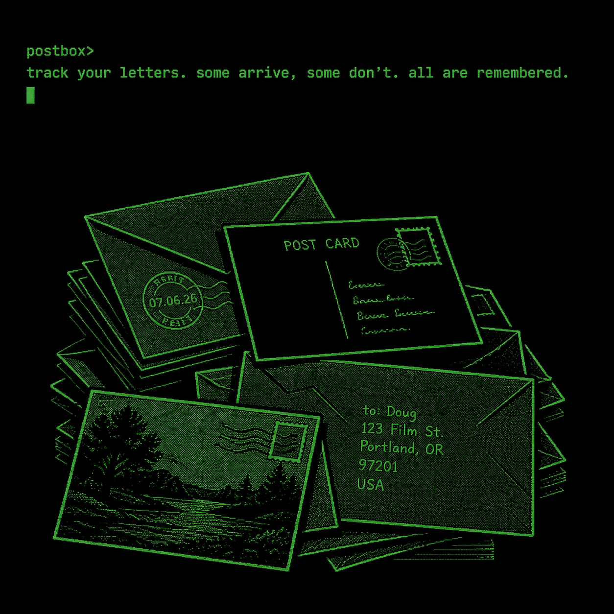

# postbox

A multi-user web journal for paper letters and postcards with Telegram authentication.

---

<div align="center">
  
</div>

---

Some letters arrive.

Some disappear.

All are remembered.

## Goal

Keep track of outgoing and incoming paper mail.

Record when a letter was sent, when it arrived (if it did), and how long the journey took.

## Quick Start

```bash
# Run everything with one command
python start.py

# Or use the bash version
./start.sh
```

Then open:
- 📖 **Web**: http://localhost:3000/login
- 🔌 **API**: http://localhost:8000

---

## Status

- ✅ Multi-user web app with Telegram Login authentication
- ✅ Auto-approval for first 5 users (configurable limit)
- ✅ JWT-based sessions and data isolation per user
- ✅ **SQLite storage** for production; optional PostgreSQL for development
- ✅ FastAPI backend with JSON REST API
- ✅ Docker Compose deployment with health checks
- 🚀 Mobile-first PWA (Next.js) without app stores

## Documentation

- [Deployment Guide](docs/deployment.md) — production setup with Docker and nginx
- [MVP](docs/mvp.md)
- [Roadmap](docs/roadmap.md)
- [Visual direction](docs/design.md)

## Tech stack

**Backend:** `Python` · `FastAPI` · `SQLAlchemy` · `SQLite` (prod) / `PostgreSQL` (dev) · `JWT` · `Telegram Login`

**Frontend:** `React` · `Next.js` · `TypeScript`

**Deployment:** `Docker` · `Docker Compose` · `nginx` (reverse proxy)
