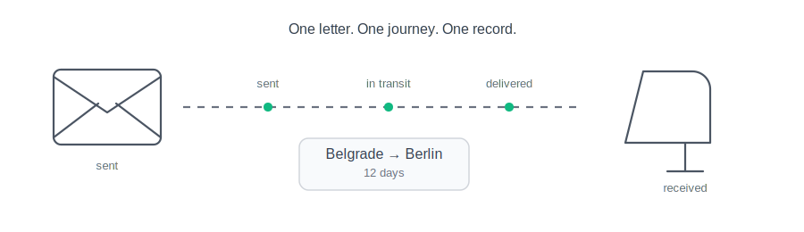

# postbox

Postbox tracks paper letters and postcards from sending to delivery.

It is a self-hosted, multi-user PWA for recording outgoing and incoming mail, delivery dates, and journey duration. Telegram Login provides authentication without a separate account system.

---

<div align="center">
  
</div>

---

## Features

- Record outgoing and incoming letters and postcards
- Track sent and delivered dates
- Calculate how long each journey took
- Keep records for mail that never arrived
- Isolate data between users
- Install the mobile-first web app as a PWA
- Sign in with Telegram

## Run locally

```bash
python start.py
```

Then open:
- 📖 **Web**: http://localhost:3000/login


## Documentation

- [Deployment Guide](docs/deployment.md) — production setup with Docker and nginx
- [MVP](docs/mvp.md)
- [Roadmap](docs/roadmap.md)
- [Visual direction](docs/design.md)
