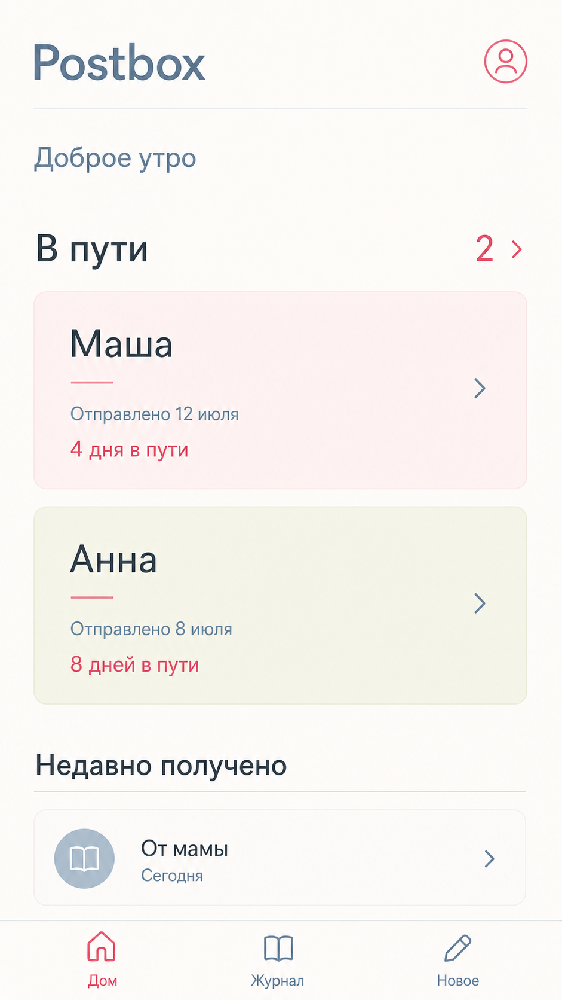

# Визуальное направление

## Тихая переписка

Postbox — спокойное личное место для бумажной почты. Интерфейс должен быть внимательным и тёплым, но не
становиться книжным, ностальгическим или декоративным.

Рабочее направление — **«Тихая переписка»**: простой шрифт без засечек, приглушённые цвета дневного света
и садовых роз, компактная информационная иерархия и low-glare поверхности для чувствительных глаз.



Это направление, а не финальный макет. Из примера берём типографику, палитру, иерархию и настроение.
Точные размеры и поведение компонентов определим в коде.

## Принципы

### Спокойно, но не пусто

Свободное пространство даёт письмам место, но на каждом экране остаётся понятное следующее действие.
Пустота не должна прятать навигацию или создавать ощущение незавершённости.

### Лично, но не книжно

Postbox может быть тёплым и камерным, но не имитирует книгу, рукописное письмо, скрапбук или старое
почтовое отделение. Вся типографика остаётся без засечек. Почтовые отсылки редкие и функциональные.

### Мягко, но не бледно

Палитра приглушённая, но текст остаётся хорошо читаемым. Важная информация передаётся словами и
структурой, а не только светлым цветом.

### Тактильно, но не скевоморфно

Мягкие поверхности и цветовые поля могут напоминать бумагу. Мы не рисуем реалистичные конверты, марки,
сгибы, объёмные тени и физические элементы управления.

### Комфортно для чувствительных глаз

Основная тема избегает чистого белого, больших светящихся областей, резких теней и лишнего контраста
между соседними поверхностями. Позже можно добавить тёмную тему, но дневная тема уже должна быть
low-glare.

## Цвет

Палитра основана на приложенной фотографии: пыльно-голубой, сливочно-шалфейный, пудрово-розовый, розовый
и ягодный. В интерфейсе используем более тёмные и спокойные оттенки, чем на фотографии.

### Основные токены

| Токен | Значение | Назначение |
| --- | --- | --- |
| `--color-canvas` | `#DAD9D2` | Основной low-glare фон |
| `--color-surface` | `#E6E3DC` | Нейтральные карточки и панели |
| `--color-surface-blue` | `#BECDD7` | Вторичные и информационные карточки |
| `--color-surface-sage` | `#D2D0AA` | Спокойные статусы и чередующиеся карточки |
| `--color-surface-blush` | `#DDBFC4` | Личные акценты и полученная почта |
| `--color-rose` | `#D77F8D` | Мягкий декоративный акцент, не для текста |
| `--color-raspberry` | `#8F3040` | Активное состояние и важное действие |
| `--color-ink` | `#243139` | Основной текст и иконки |
| `--color-ink-muted` | `#536A78` | Метаданные и вторичные подписи |
| `--color-border` | `#AEB7B8` | Разделители и границы элементов |

### Правила использования

- Не использовать чистые `#FFFFFF` и `#000000` для больших поверхностей и основного текста.
- Ягодный цвет — акцент, а не основной цвет текста.
- Розовый цвет декоративный и не передаёт состояние самостоятельно.
- На одном уровне иерархии использовать не больше двух оттенков карточек.
- Перед реализацией проверять контраст текста на его фактической поверхности.
- У статуса всегда есть текстовая подпись; цвет только усиливает её.

## Типографика

Рабочий шрифт — **Onest** с системным fallback:

```css
font-family: "Onest", -apple-system, BlinkMacSystemFont, "Segoe UI", sans-serif;
```

Onest используется и для заголовков, и для основного текста. Характер создают интервалы, масштаб и
насыщенность, а не смешение нескольких гарнитур.

### Шкала

| Роль | Размер / интерлиньяж | Насыщенность |
| --- | --- | --- |
| Название приложения | `32px / 38px` | `600` |
| Заголовок экрана | `28px / 34px` | `600` |
| Заголовок раздела | `22px / 28px` | `600` |
| Заголовок карточки | `20px / 26px` | `500` |
| Основной текст | `16px / 24px` | `400` |
| Метаданные | `14px / 20px` | `400` |
| Кнопка | `16px / 20px` | `500` |

### Правила типографики

- Использовать только насыщенности `400`, `500` и `600`.
- Не использовать тонкие начертания, курсив, капслок, рукописные, моноширинные шрифты и засечки.
- Основной текст по возможности оставлять размером `16px`.
- Заголовки и действия писать в обычном регистре.
- Делать метаданные короткими: `Отправлено 12 июля`, `4 дня в пути`.
- Поддерживать системное увеличение текста без обрезки и карточек фиксированной высоты.

## Сетка

Postbox проектируется mobile-first для узкого вертикального экрана.

### Интервалы

| Токен | Значение |
| --- | --- |
| `--space-1` | `4px` |
| `--space-2` | `8px` |
| `--space-3` | `12px` |
| `--space-4` | `16px` |
| `--space-5` | `24px` |
| `--space-6` | `32px` |
| `--space-7` | `48px` |

### Геометрия

- Горизонтальные поля экрана: `20px`.
- Минимальная область нажатия: `44px × 44px`.
- Радиус карточки: `16px`.
- Радиус элемента управления: `12px`.
- Карточки отделяются границей или цветом поверхности раньше, чем тенью.
- Если тень нужна, она широкая, прозрачная и визуально вторичная.
- Высота контента свободная: текст не обрезается ради декоративной композиции.

## Компоненты

### Каркас приложения

- Название Postbox набрано шрифтом без засечек.
- В правом верхнем углу — небольшое действие профиля или настроек.
- Внизу постоянная навигация: `Дом`, `Журнал`, `Новое`.
- Активный пункт использует ягодный цвет и подпись; остальные — приглушённый сине-серый.

### Карточка письма

- Имя корреспондента — самая заметная строка.
- Дата события и время в пути образуют второй уровень.
- Направление и статус понятны без расшифровки иконки.
- У карточки одно главное действие по нажатию.
- Цвет может различать группы, но не закрепляется навсегда за конкретным человеком.

### Заголовок раздела

- Короткое название с необязательным счётчиком или компактным действием.
- Без очень крупных журнальных заголовков.
- Разделы отделяются сначала пространством и только при необходимости тонкой линией.

### Формы

- За один шаг задавать один осмысленный вопрос.
- Использовать нативный выбор даты там, где он надёжен, и показывать текстовое резюме перед сохранением.
- Оставлять подтверждение для разрушительных или трудно исправимых действий.
- Ошибку показывать рядом с полем и объяснять, как её исправить.

## Иконки

- Простые контурные иконки со скруглёнными соединениями.
- Единая толщина линии и оптический размер.
- В основной навигации иконка поддерживает подпись, а не заменяет её.
- Не повторять как декор марки, сургуч, перья, почтовые ящики и конверты.

## Движение

- Базовая длительность перехода: `160–220ms`.
- Использовать прозрачность и небольшое смещение; не увеличивать карточки и не применять упругую анимацию.
- Сохранение письма может сопровождаться одним спокойным завершающим движением.
- Уважать `prefers-reduced-motion`; все сценарии работают без анимации.

## Голос

Интерфейс говорит просто и мягко.

Подходит:

- `Когда письмо дошло?`
- `Дата отправки неизвестна`
- `Письмо в пути 4 дня`
- `Заметка сохранена`

Не подходит:

- канцелярский язык статусов;
- излишняя сентиментальность;
- геймификация и празднование обычных действий;
- метафоры, которые скрывают результат нажатия.

## Проверка доступности

- [ ] Контраст текста соответствует WCAG AA на каждой фактической поверхности.
- [ ] Ни одно важное состояние не передаётся только цветом или иконкой.
- [ ] Области нажатия не меньше `44px × 44px`.
- [ ] Интерфейс работает с увеличенным системным текстом.
- [ ] Фокус виден при клавиатурном и вспомогательном вводе.
- [ ] Анимация учитывает `prefers-reduced-motion`.
- [ ] При загрузке нет полноэкранной вспышки чистого белого цвета.
- [ ] Продуманы loading, empty, offline, error и success состояния.

## Первая реализация

Первый экран для проверки стиля в коде — мобильный **Дом**:

1. Шапка Postbox.
2. Раздел `В пути` с двумя карточками.
3. Раздел `Недавно получено`.
4. Нижняя навигация.
5. Пустое и offline-состояния.

Перед фиксацией токенов экран нужно проверить на настоящем iPhone при обычной вечерней яркости.
